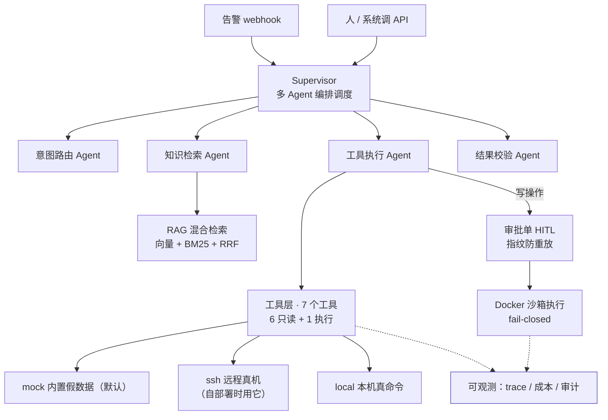

<div align="center">

# AgentDesk

**面向运维场景的多 Agent 智能体系统**

把「查日志 / 看磁盘 / 看容器 / 定位故障」从记几十条命令，变成说一句话。


**[▶ 部署到你自己的机器](docs/quickstart-own-server.md)　·　[项目全景](docs/overview.md)　·　[评测数据](#实测数据)**

</div>

---

输入「nginx 报 502 了，帮我看下」，Agent 自己决定查什么、看结果、再决定下一步，
  
最后给出**带引用、可追溯**的结论。

差别不是少敲几条命令，而是从「我操作工具」变成「我表达意图」。

> [!NOTE]
>   
> **演示实例**曾部署在阿里云一台 **2 核 2G** 的 ECS 上（与 WordPress、Zabbix 共 **8 个容器**共存，
>   
> 容器 SSH 回宿主机查真实数据；完整部署实录与安全取舍见 [部署文档](docs/deployment.md)），
>   
> **当前暂停对外开放** —— 要体验，按 [三步 Quickstart](docs/quickstart-own-server.md)
>   
> 部署到你自己的机器（默认仿真模式 1 分钟跑通，连你自己的服务器再配三行）。

---

## 实测数据

所有数字都由本仓库脚本产出，**可复现**（命令见每行右侧与 [评测文档](docs/evaluation.md)）：

| 能力           | 指标                               |                                  结果                                 |
| ------------ | -------------------------------- | :-----------------------------------------------------------------: |
| **检索**       | 召回率（32 条库内题、10 篇语料 91 块，纯检索不调模型） | **hybrid Top-8 100%** Top-5 96.9% · Top-3 90.6% · 纯 BM25 Top-5 100% |
| **检索 · 语义型** | 换一套词问同一件事，6 条                    |           **hybrid 100%** 纯向量 83.3% · 纯 BM25 83.3% ← 见下方说明          |
| **生成质量**     | 答案相关性 / 忠实度均分（1–5，库内 30 条）       |                           **4.70 / 4.97**                           |
| **不编造**      | 库外问题拒答率                          |                        **100%** 裸模型对照 **0%**                        |
| **不误拒**      | 库内问题作答率                          |                              **96.7%**                              |
| **引用可靠**     | 引用编号越界次数                         |                                **0**                                |
| **编排**       | 意图路由全字段准确率（22 条，逐字段判定）           |                          **95.5%** （21/22）                          |
| **可观测**      | 成本两个维度与总账的对账偏差                   |                   **≤0.1%** 对账结果由接口返回，偏差 >1% 自动告警                   |
| **工程**       | 容器稳态内存                           |                    **144 MB** 限制 400MB，CPU 0.15%                    |
| **成本**       | 40 条端到端评测（含裸模型对照）                |                   **¥0.55** 语料翻倍后上下文变长，单次成本约 2.3 倍                  |

复现命令（前两条不花钱）：

```bash
python -m app.rag.pipeline eval --top-k 8     # 检索召回率（纯检索，零成本）
.venv/Scripts/python.exe scripts/eval_specialists.py   # 意图路由
.venv/Scripts/python.exe scripts/run_eval.py           # 40 条端到端（含裸模型对照，约 5 分钟）
```

---

## 核心能力

- **🔍 混合检索 RAG** —— 10 篇运维语料（91 块）+ 向量 / BM25 双路召回，RRF 融合。带引用溯源，答不了就明确说不知道。
    
  ⚠️ 向量后端在未配置 `DASHSCOPE_API_KEY` 时会退回词袋哈希兜底（无语义能力）——详见[实测数据](#实测数据)那节的说明。
- **🤖 多 Agent 编排** —— Supervisor 调度 4 个专业 Agent（意图路由 / 知识检索 / 工具执行 / 结果校验），7 个节点 5 条回边。
- **🧰 工具层** —— 7 个运维工具（6 个只读 + 1 个白名单执行），参数过正则白名单（`"web-01; rm -rf /"` 直接拒），**绝不拼 shell**。
- **🛡️ 沙箱 + 人工确认** —— 写操作不自动执行：命令白名单 → 审批单（指纹防重放）→ 一次性容器。沙箱不可用时 **fail-closed**，拒绝执行而非降级。
- **📊 全链路可观测** —— 每次运行留下 trace（span 树）、成本归因（按 Agent/动作双维）、审计日志。
- **🚨 事件闭环 + 出站通知** —— 告警按「主机+服务」聚合成**一个事件**（50 条同源告警只跑 1 次诊断），
  支持维护窗口抑制；诊断结论/待审批/执行结果**推给值班的人**（通用 webhook / 钉钉 / 飞书，含加签、去重、重试）。
  ⚠️ 默认**不出站**（`NOTIFY_CHANNELS` 留空即完全关闭）；开了之后出站正文默认脱敏。
- **🔌 MCP 协议出口** —— 同一批工具以标准 MCP 暴露，Cursor / Claude Desktop 可直接调用。
- **🔐 公网安全层** —— 白名单鉴权 + 三层限流 + 每日额度。上线 20 分钟拦下 57 次未授权扫描。
    
  ⚠️ 限流与每日额度是**单进程内存态**：服务重启后当日额度归零，开多 worker 时各进程各算各的（实际额度会翻倍）。部署上固定 `--workers 1`；要多实例需把计数器换成 Redis。

---

## 架构



---

## 快速开始

```bash
git clone <本仓库> && cd agentdesk
python -m venv .venv
.venv\Scripts\python.exe -m pip install -r requirements.txt   # Windows
# source .venv/bin/activate && pip install -r requirements.txt  # Linux/macOS
```

填入密钥（`.env` 已被 gitignore）：

```env
DEEPSEEK_API_KEY=sk-你的key
```

一条命令验证九层技术栈都在工作：

```bash
.venv\Scripts\python.exe scripts\smoke_test.py
```

启动服务：

```bash
.venv\Scripts\python.exe -m uvicorn app.main:app --reload --port 8000
```

打开 <http://127.0.0.1:8000/try> 直接试用，或 <http://127.0.0.1:8000/docs> 看接口文档。

> [!TIP]
>   
> 本地开发不设 `AUTH_ENABLED`，所有接口免令牌。部署到公网时才需要打开（见 [部署文档](docs/deployment.md)）。

---

## 工具层的数据来源

工具层（Agent 的「手」）有三条数据来源，用 `OPS_BACKEND` 切换：

| 后端             | 行为                                                            | 什么时候用                   |
| -------------- | ------------------------------------------------------------- | ----------------------- |
| **`mock`**（默认） | 返回三台虚构机器（`web-01` / `db-01` / `cache-01`）的固定数据                | 演示、评测、任何机器上 clone 下来就能跑 |
| **`local`**    | 在本机真执行 `df -hP` / `systemctl` / `docker ps -a` / `tail`（全部只读） | Linux 上查看**本机**真实状态     |
| **`ssh`**      | 通过 SSH 到真实远程主机，执行同一批只读命令                                      | 查看**远程**真机              |

> **演示实例曾用 `ssh`**（容器 SSH 回自己所在的宿主机查真实数据），
>   
> 属于**明知代价仍然做的取舍**，不是默认行为 —— 完整说明见 [部署文档](docs/deployment.md)。
>   
> 默认值仍是 `mock`：别人 clone 下来不配任何东西就能跑通整条链路；
>   
> 要连自己的服务器，见 [三步 Quickstart](docs/quickstart-own-server.md)。

```env
OPS_BACKEND=ssh
OPS_SSH_TARGETS=web-01=root@10.0.0.1     # 逻辑名=用户@地址[:端口]
OPS_SSH_KEY=~/.ssh/agentdesk_ops          # 用专用密钥，别复用平时登录那把
```

**默认为什么是 `mock`**：那 40 条评测集依赖固定输出。工具层如果一开始就要求
  
"真的连上一台机器"，别人 clone 下来就什么都看不到 —— 整条链路都跑不起来。

### 逻辑主机名与真实地址是解耦的

Agent 只知道 `web-01` 这样的**逻辑名**，它不知道、也不该知道那台机器在哪 ——
  
映射放在 `OPS_SSH_TARGETS` 里。两个好处：

1. 换机器只改配置，prompt / 评测集 / 文档一行都不用动
2. **模型无法自己编一个 IP 去连** —— 它能选的只有清单里的名字

### ⚠️ `ssh` 后端下执行通道是关闭的（fail-closed）

诊断可以看远端，但沙箱的执行通道目前只在本机落地。
  
「诊断在远端、执行在本地」这种错配比「不能执行」危险得多 ——
  
打错的机器和打对的机器只差一个环境变量，不该靠"记得改"来避免。

所以 `run_command` 在 `ssh` 后端下会直接拒绝：不提交审批，也不执行。
  
需要在真机上做处置时，请在目标主机上以 `OPS_BACKEND=local` 运行。

### 想直接看真机原始数据？

问 Agent「磁盘还剩多少」，拿到的是**模型转述后**的答案。
  
要确认"它到底从机器上读到了什么"，把模型摘掉：

```bash
.venv\Scripts\python.exe scripts\show_live.py
.venv\Scripts\python.exe scripts\show_live.py --only tail_log --service wp-app
```

原样打印工具层的 JSON，不花 token、也没有任何转述。

> [!NOTE]
>   
> 切换后端只影响工具层，**Agent 编排层一行都不用改** ——
>   
> 它只负责"调哪个工具"，不关心这个工具的数据从哪来。
>   
> 另外 `local` 在容器里跑没有意义（容器内没有 systemd、没有 docker CLI），
>   
> 那种场景要用 `ssh`。

---

## 它和通用 AI 助手的区别

**先承认：如果只是「我随口问一句、它帮我看服务器」，通用助手确实更划算。**
  
单机、单人、有人在场的场景不值得自建 —— 硬说自己的更强只会显得不懂行。

真正的差别在后面几行：

| 维度   | 通用 AI 助手  | AgentDesk                                 |
| ---- | --------- | ----------------------------------------- |
| 触发方式 | 人打开界面打字   | 告警 webhook、其他系统调 API，**无人值守**             |
| 交付形态 | 一个会话窗口    | 一个 HTTP 服务                                |
| 权限边界 | 给了凭据就全部放行 | 命令白名单 + 只读 + 一次性容器 + 高危操作人工确认             |
| 审计   | 聊天记录，非结构化 | 每次操作落库：谁触发、跑了什么、结果如何                      |
| 可靠性  | 无法证明      | 任务完成率 / 工具准确率 / P95 延迟 / Token 成本，**可量化** |

**最本质的是最后两行。** 生产环境要的不是「它好像挺聪明」，
  
是「我能量出它有 XX% 的任务完成率，并且知道剩下那部分错在哪」。

而且这两者不是竞争关系 —— 这批工具已经封装成 **MCP Server**，
  
挂上 Cursor 之后通用助手可以直接调用 AgentDesk 的能力。

```bash
.venv\Scripts\python.exe -m app.mcp_server.server        # stdio 模式
.venv\Scripts\python.exe scripts\mcp_check.py            # 协议层自检，9/9
```

---

## 接口

35 个路由（30 个进 OpenAPI 文档），按功能分组（本地起服务后打开 <http://127.0.0.1:8000/docs> 即可）：
<details>

<summary><b>Agent 与检索</b></summary>

| 方法   | 路径             | 说明                                                                  |
| ---- | -------------- | ------------------------------------------------------------------- |
| POST | `/agent/ask`   | **Agent 自主诊断**（`engine`：`handwritten` / `langgraph` / `supervisor`） |
| GET  | `/agent/tools` | 工具清单（含风险等级）                                                         |
| GET  | `/agent/graph` | 导出编排图的 mermaid 定义                                                   |
| POST | `/rag/ask`     | RAG 问答，带引用溯源                                                        |
| POST | `/rag/search`  | 只检索不生成（排查检索质量）                                                      |
| GET  | `/rag/stats`   | 索引统计                                                                |
| POST | `/rag/index`   | 重建索引                                                                |

</details>

<details>

<summary><b>基础对话与告警</b></summary>

| 方法   | 路径               | 说明                   |
| ---- | ---------------- | -------------------- |
| POST | `/chat`          | 一次性返回完整回答            |
| POST | `/chat/stream`   | SSE 流式返回             |
| POST | `/parse`         | 意图解析：一句话 → 结构化 JSON  |
| POST | `/webhook/alert` | **告警驱动入口**（无人值守自动诊断） |

</details>

<details>

<summary><b>沙箱与人工确认</b></summary>

| 方法   | 路径                        | 说明            |
| ---- | ------------------------- | ------------- |
| GET  | `/sandbox`                | 沙箱状态 + 命令白名单  |
| GET  | `/approvals`              | 待人工确认的审批单列表   |
| GET  | `/approvals/{id}`         | 审批单详情         |
| POST | `/approvals/{id}/approve` | 批准（必须填审批人）    |
| POST | `/approvals/{id}/reject`  | 驳回            |
| POST | `/approvals/{id}/execute` | 执行已批准的命令（一次性） |

</details>

<details>

<summary><b>事件（一个故障一个对象）</b></summary>

| 方法   | 路径                         | 说明                     |
| ---- | -------------------------- | ---------------------- |
| GET  | `/incidents`               | 事件列表（含聚合模式与通知状态）       |
| GET  | `/incidents/{id}`          | 单个事件详情（完整时间线 + 成员告警）   |
| POST | `/incidents/{id}/ack`      | 认领（**必须填 `by`**：谁在处理）  |
| POST | `/incidents/{id}/resolve`  | 结单（**必须填 `by`**：谁结的、为什么结） |

告警进来时按「主机 + 服务」聚合：50 条同源告警 → **1 个事件、1 次诊断、1 条通知**。
被抑制的告警不会被丢弃 —— 响应里会带上它并入了哪个事件。

</details>

<details>

<summary><b>可观测与运维</b></summary>

| 方法  | 路径                  | 说明                     |
| --- | ------------------- | ---------------------- |
| GET | `/traces`           | 链路追踪列表                 |
| GET | `/traces/{id}`      | 单次运行的完整 span 树         |
| GET | `/metrics/summary`  | 成本看板（按 Agent / 动作双维聚合） |
| GET | `/audit`            | 审计日志                   |
| GET | `/health`           | 健康检查（含安全层状态）           |
| GET | `/` ` /try` `/docs` | 首页 / 在线试用 / 接口文档（免令牌）  |

</details>

**公网调用要带令牌**（本地开发默认关闭）：

```bash
curl -H "X-API-Key: <你的令牌>" \
     -H "Content-Type: application/json" \
     -d '{"question":"web-01 磁盘快满了怎么处理"}' \
     http://127.0.0.1:8000/rag/ask
```

---

## 自检与测试

**两件事要分清**：`smoke_test.py` 是**环境自检**（回答"这台机器上九层技术栈通不通"），
`pytest` 是**回归测试**（回答"这次改动有没有弄坏既有行为"）。
前者需要密钥、会花钱；后者零成本、不碰网络、每次提交都能跑。

```bash
# ---- 环境自检（会真实调用模型：快速档约 ¥0.001，--full 再加一次 Agent 调用约 ¥0.02）----
.venv\Scripts\python.exe scripts\smoke_test.py            # 快速（跳过花钱项）
.venv\Scripts\python.exe scripts\smoke_test.py --full     # 含真实 Agent 调用
.venv\Scripts\python.exe scripts\smoke_test.py --strict   # 环境未就绪即算失败（退出码 2）

# ---- 回归测试与门禁（零成本、无网络）----
.venv\Scripts\python.exe -m pip install -r requirements-dev.txt
.venv\Scripts\python.exe -m pytest -q                     # 单元 + 接口层（进程内 TestClient）
.venv\Scripts\python.exe -m ruff check tests              # lint（当前只强制 tests/）
.venv\Scripts\python.exe scripts\security_check.py        # 公网安全层 23 项
.venv\Scripts\python.exe scripts\mcp_check.py             # MCP 协议层 9/9
.venv\Scripts\python.exe scripts\eval_baseline.py         # 检索基线门禁（退化超容差即失败）
```

**退出码**：`0` = 已检查项全通 · `1` = 有真失败项 · `2` = `--strict` 且存在"环境未就绪导致的未验证项"。

**"跳过"分三类，汇总里分开列**：环境未就绪（该验证却没验证，`--strict` 下算失败）／
主动不跑（未加 `--full`，要花钱）／无数据可验证（还没有 trace 或审批单）。
如此区分的原因很直接：**"没检查"和"检查通过"必须能被区分开** ——
早先三种混在一起时，服务根本没启动也照样 `exit 0` 并打印"已检查的项目全部通过"。

CI 见 [`.github/workflows/ci.yml`](.github/workflows/ci.yml)：
必需档**零成本**（pytest + ruff + mypy + 安全层 + MCP + 检索基线），
真实模型端到端档手动触发（需要仓库配置 `DEEPSEEK_API_KEY`）。

| 层         | 覆盖内容                     |
| --------- | ------------------------ |
| 1 · 环境    | Python 版本、依赖、密钥是否就位      |
| 2 · 模型    | 真实调用一次，验证连通与成本计算         |
| 3 · 检索    | 索引加载、三种检索模式、召回率          |
| 4 · Agent | 工具注册表、编排引擎、校验器正反例        |
| 5 · 沙箱    | 白名单、审批状态机、fail-closed 行为 |
| 6 · 观测    | trace 嵌套顺序、成本归因口径        |
| 7 · 评测    | 评测资产本身的自证（判定器不自欺）        |
| 8 · MCP   | schema 漂移校验、协议层握手        |
| 9 · 接口    | OpenAPI 操作里抽测（入口标题不写死条数，条数由脚本现场统计） |

---

## 项目结构

```
agentdesk/
├── app/
│   ├── llm.py              模型调用统一入口
│   ├── main.py             FastAPI 服务入口（35 个路由）
│   ├── security.py         公网安全层：白名单鉴权 + 三层限流 + 每日额度
│   ├── rag/                检索层：切分 / 向量化 / 存储 / 混合检索管线
│   ├── tools/              工具层：7 个运维工具（6 只读 + 1 执行）+ 参数白名单
│   ├── agents/             编排层：手写 ReAct / LangGraph / Supervisor
│   ├── sandbox/            沙箱：策略 / 执行器 / 审批单
│   ├── alerting/           告警入口：归一化 / 聚合（有界 TTL 表）/ 维护窗口抑制
│   ├── incident/           事件：一个故障一个对象（追加日志 + 折叠）
│   ├── notify/             出站通知：webhook / 钉钉 / 飞书 + 重试 + 脱敏
│   ├── observability/      trace / 成本归因 / Langfuse 导出
│   ├── evaluation/         评测判定器
│   └── mcp_server/         MCP 协议出口
├── data/
│   ├── knowledge/          运维知识库语料（10 篇）
│   └── index/              构建产物（可重建，不进仓库）
├── docs/                   专题文档（见下）+ redev/ 二次创作尽调与路线图
├── eval/                   评测集、报告与检索基线（baseline.json）
├── scripts/                自检 / 评测 / 演示脚本
├── tests/                  pytest 回归测试（零成本、无网络，见 conftest.py）
├── .github/workflows/      CI：必需档零成本 + 真实模型档手动触发
├── pyproject.toml          工具链配置（ruff / pytest / mypy；**不是**打包配置）
├── Dockerfile              生产镜像（非 root + 健康检查 + workers=1）
├── docker-compose.yml      生产编排（内存硬上限 + 端口只绑回环）
├── requirements.txt        直接依赖仅 9 个
└── requirements-dev.txt    开发依赖 3 个（pytest / ruff / mypy）
```

---

## 技术栈

直接依赖 **9 个**，其余全部手写：

| 层    | 选型                                    | 为什么                                |
| ---- | ------------------------------------- | ---------------------------------- |
| 语言   | Python 3.12                           | AI 生态验证最充分的区间                      |
| 模型调用 | httpx 手写 + DeepSeek                   | 手写看得清协议细节；OpenAI 兼容格式，换服务商只改配置     |
| 服务   | FastAPI + uvicorn                     | 原生 async（SSE 必需）+ pydantic 自动校验与文档 |
| 检索   | numpy 内存索引 + BM25(jieba) + RRF        | 50 块规模用不上向量库，一次矩阵乘法几毫秒             |
| 向量化  | 可插拔：百炼 `text-embedding-v3` / local 兜底 | 没有额外 Key 也能跑通链路自测                  |
| 编排   | LangGraph                             | 状态图 + 检查点（与手写版并存对比）                |
| 工具协议 | MCP SDK                               | 7 个工具暴露给任何 MCP 客户端                 |
| 沙箱   | Docker 一次性容器 + 命令白名单                  | 写操作隔离执行，不可用时 fail-closed           |
| 部署   | Docker Compose + Nginx Proxy Manager  | 复用已有反代与证书体系                        |

> [!NOTE]
>   
> 每一项的**替代方案、取舍、升级时机，以及"怎么验证它在工作"**，见
>   
> [`docs/tech-stack.md`](docs/tech-stack.md)。这份文档比上表详细得多 ——
>   
> 比如为什么用 RRF 而不是加权平均、为什么不用 Milvus。

---

## 文档

| 文档                                           | 什么时候看                   |
| -------------------------------------------- | ----------------------- |
| [项目全景](docs/overview.md)                     | 想知道「做了什么、怎么用、值不值得看」     |
| [项目框架](docs/project-map.md)                  | 想理解每个文件干什么、怎么串起来        |
| [技术栈](docs/tech-stack.md)                    | 想看选型理由与替代方案             |
| [多 Agent 编排](docs/multi-agent.md)            | 拆分理由、校验 Agent 设计、踩过的五个坑 |
| [沙箱与人工确认](docs/sandbox-hitl.md)              | 三层职责、五个坑、常见追问           |
| [事件与出站通知](docs/incident-notify.md)             | 告警怎么聚合成事件、通知怎么配、没收到怎么排障 |
| [可观测](docs/observability.md)                 | Trace 与成本归因的设计          |
| [评测](docs/evaluation.md)                     | 六维度设计、判定器自证、误报排查        |
| [MCP Server](docs/mcp-server.md)             | 协议原理、四个真实坑、客户端配置        |
| [ReAct 与 LangGraph](docs/react-langgraph.md) | 两个实现的对比与取舍              |
| [公网部署](docs/deployment.md)                   | 安全层设计、内存判断、运维手册         |

---

## License

[MIT](LICENSE)
