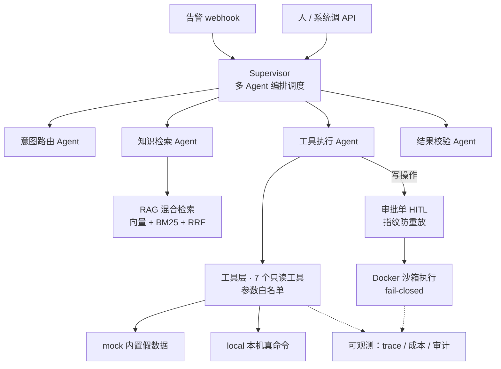

<div align="center">

# AgentDesk

**面向运维场景的多 Agent 智能体系统**

把「查日志 / 看磁盘 / 看容器 / 定位故障」从记几十条命令，变成说一句话。

[](https://www.python.org/)
[](https://fastapi.tiangolo.com/)
[](LICENSE)
[](#自检)

**[▶ 在线试用](https://agent.simosheng.fun/try)　·　[接口文档](https://agent.simosheng.fun/docs)　·　[项目全景](docs/overview.md)**

</div>

---

输入「nginx 报 502 了，帮我看下」，Agent 自己决定查什么、看结果、再决定下一步，
最后给出**带引用、可追溯**的结论。

差别不是少敲几条命令，而是从「我操作工具」变成「我表达意图」。

> [!NOTE]
> 在线实例跑在阿里云一台 **2 核 2G** 的 ECS 上，与 WordPress、Zabbix 共 **8 个容器**共存
> （部署时可用内存仅 359MB、swap=0，见 [部署文档](docs/deployment.md)）。
> 试用页需要访问令牌；演示数据来自工具层的 `mock` 后端 —— 它**不连接任何真实机器**，
> 原因见 [下面这一节](#关于演示数据)。

---

## 实测数据

所有数字都由本仓库脚本产出，可复现（`scripts/run_eval.py` · `scripts/eval_specialists.py` · `scripts/smoke_test.py`）。

| 能力 | 指标 | 结果 |
| --- | --- | :---: |
| **检索** | Top-3 召回率（`向量 + BM25` 经 RRF 融合） | **100.0%** <sub>（纯向量 93.8% · 纯 BM25 96.9%）</sub> |
| **生成质量** | 答案忠实度均分（1–5，库内 30 条） | **4.97** |
| **不编造** | 库外问题拒答率 | **100.0%** <sub>（裸模型对照 **0.0%**）</sub> |
| **引用可靠** | 引用编号越界次数 | **0** |
| **编排** | 意图路由全字段准确率 | **90.0%** <sub>（18/20，逐字段判定）</sub> |
| **可观测** | Trace / 成本 / 审计三者对账 | 一致 |
| **工程** | 容器稳态内存 | **144 MB** <sub>（限制 400MB，CPU 0.15%）</sub> |
| **成本** | 40 条端到端评测（含裸模型对照） | **¥0.55** |

> [!IMPORTANT]
> `库外拒答 100% vs 裸模型 0%` 这个差值，就是 RAG 在「不乱说」上的可量化收益。
> 检索**永远**会返回 top-k 结果，哪怕全都不相关 —— 所以「知识库里没有」不能靠
> 分数阈值判断（实测：库外题最高分 0.030–0.033，库内题 0.031–0.033，几乎无差别）。
> 完整方法论见 [评测文档](docs/evaluation.md)。

---

## 核心能力

- **🔍 混合检索 RAG** —— 向量 + BM25 双路召回，RRF 融合。带引用溯源，答不了就明确说不知道。
- **🤖 多 Agent 编排** —— Supervisor 调度 4 个专业 Agent（意图路由 / 知识检索 / 工具执行 / 结果校验），7 个节点 5 条回边。
- **🧰 工具层** —— 7 个只读运维工具，参数过正则白名单（`"web-01; rm -rf /"` 直接拒），**绝不拼 shell**。
- **🛡️ 沙箱 + 人工确认** —— 写操作不自动执行：命令白名单 → 审批单（指纹防重放）→ 一次性容器。沙箱不可用时 **fail-closed**，拒绝执行而非降级。
- **📊 全链路可观测** —— 每次运行留下 trace（span 树）、成本归因（按 Agent/动作双维）、审计日志。
- **🔌 MCP 协议出口** —— 同一批工具以标准 MCP 暴露，Cursor / Claude Desktop 可直接调用。
- **🔐 公网安全层** —— 白名单鉴权 + 三层限流 + 每日额度。上线 20 分钟拦下 57 次未授权扫描。

---

## 架构



---

## 快速开始

```bash
git clone <本仓库> && cd agentdesk
python -m venv .venv
.venv\Scripts\python.exe -m pip install -r requirements.txt   # Windows
# source .venv/bin/activate && pip install -r requirements.txt  # Linux/macOS
```

填入密钥（`.env` 已被 gitignore）：

```env
DEEPSEEK_API_KEY=sk-你的key
```

一条命令验证九层技术栈都在工作：

```bash
.venv\Scripts\python.exe scripts\smoke_test.py
```

启动服务：

```bash
.venv\Scripts\python.exe -m uvicorn app.main:app --reload --port 8000
```

打开 <http://127.0.0.1:8000/try> 直接试用，或 <http://127.0.0.1:8000/docs> 看接口文档。

> [!TIP]
> 本地开发不设 `AUTH_ENABLED`，所有接口免令牌。部署到公网时才需要打开（见 [部署文档](docs/deployment.md)）。

---

## 关于演示数据

**工具层默认返回内置的模拟数据，不连接任何真实机器。** 这是刻意的设计，不是偷懒：

| 后端 | 行为 | 什么时候用 |
| --- | --- | --- |
| **`mock`**（默认） | 返回三台虚构机器（`web-01` / `db-01` / `cache-01`）的固定数据 | 演示、评测、任何机器上 clone 下来就能跑 |
| **`local`** | 真执行 `df -h` / `systemctl status` / `docker ps -a` / `tail`（全部只读） | Linux 上查看**本机**真实状态 |

```bash
OPS_BACKEND=local   # 切到真机模式
```

> [!WARNING]
> `local` 在容器里跑没有意义（容器内没有 systemd、没有 docker CLI）。
> 要查**远程**机器需要新增 SSH 数据源 —— 目前尚未实现。
> 切换后端只影响工具层，**Agent 编排层一行都不用改**。

这样设计的原因是**可复现**：Day 9 那 40 条评测集依赖固定输出。
如果工具一开始就依赖"真的连上一台机器"，那这个项目在别人电脑上就完全跑不起来。

---

## 它和通用 AI 助手的区别

**先承认：如果只是「我随口问一句、它帮我看服务器」，通用助手确实更划算。**
单机、单人、有人在场的场景不值得自建 —— 硬说自己的更强只会显得不懂行。

真正的差别在后面几行：

| 维度 | 通用 AI 助手 | AgentDesk |
| --- | --- | --- |
| 触发方式 | 人打开界面打字 | 告警 webhook、其他系统调 API，**无人值守** |
| 交付形态 | 一个会话窗口 | 一个 HTTP 服务 |
| 权限边界 | 给了凭据就全部放行 | 命令白名单 + 只读 + 一次性容器 + 高危操作人工确认 |
| 审计 | 聊天记录，非结构化 | 每次操作落库：谁触发、跑了什么、结果如何 |
| 可靠性 | 无法证明 | 任务完成率 / 工具准确率 / P95 延迟 / Token 成本，**可量化** |

**最本质的是最后两行。** 生产环境要的不是「它好像挺聪明」，
是「我能量出它有 XX% 的任务完成率，并且知道剩下那部分错在哪」。

而且这两者不是竞争关系 —— 这批工具已经封装成 **MCP Server**，
挂上 Cursor 之后通用助手可以直接调用 AgentDesk 的能力。

```bash
.venv\Scripts\python.exe -m app.mcp_server.server        # stdio 模式
.venv\Scripts\python.exe scripts\mcp_check.py            # 协议层自检，9/9
```

---

## 接口

22 个接口，按功能分组（完整定义见 [在线文档](https://agent.simosheng.fun/docs)）：

<details>
<summary><b>Agent 与检索</b></summary>

| 方法 | 路径 | 说明 |
| --- | --- | --- |
| POST | `/agent/ask` | **Agent 自主诊断**（`engine`：`handwritten` / `langgraph` / `supervisor`） |
| GET | `/agent/tools` | 工具清单（含风险等级） |
| GET | `/agent/graph` | 导出编排图的 mermaid 定义 |
| POST | `/rag/ask` | RAG 问答，带引用溯源 |
| POST | `/rag/search` | 只检索不生成（排查检索质量） |
| GET | `/rag/stats` | 索引统计 |
| POST | `/rag/index` | 重建索引 |

</details>

<details>
<summary><b>基础对话与告警</b></summary>

| 方法 | 路径 | 说明 |
| --- | --- | --- |
| POST | `/chat` | 一次性返回完整回答 |
| POST | `/chat/stream` | SSE 流式返回 |
| POST | `/parse` | 意图解析：一句话 → 结构化 JSON |
| POST | `/webhook/alert` | **告警驱动入口**（无人值守自动诊断） |

</details>

<details>
<summary><b>沙箱与人工确认</b></summary>

| 方法 | 路径 | 说明 |
| --- | --- | --- |
| GET | `/sandbox` | 沙箱状态 + 命令白名单 |
| GET | `/approvals` | 待人工确认的审批单列表 |
| GET | `/approvals/{id}` | 审批单详情 |
| POST | `/approvals/{id}/approve` | 批准（必须填审批人） |
| POST | `/approvals/{id}/reject` | 驳回 |
| POST | `/approvals/{id}/execute` | 执行已批准的命令（一次性） |

</details>

<details>
<summary><b>可观测与运维</b></summary>

| 方法 | 路径 | 说明 |
| --- | --- | --- |
| GET | `/traces` | 链路追踪列表 |
| GET | `/traces/{id}` | 单次运行的完整 span 树 |
| GET | `/metrics/summary` | 成本看板（按 Agent / 动作双维聚合） |
| GET | `/audit` | 审计日志 |
| GET | `/health` | 健康检查（含安全层状态） |
| GET | `/` ` /try` `/docs` | 首页 / 在线试用 / 接口文档（免令牌） |

</details>

**公网调用要带令牌**（本地开发默认关闭）：

```bash
curl -H "X-API-Key: <你的令牌>" \
     -H "Content-Type: application/json" \
     -d '{"question":"web-01 磁盘快满了怎么处理"}' \
     https://agent.simosheng.fun/rag/ask
```

---

## 自检

一条命令跑完九层，退出码 0 = 全通，可接进 CI：

```bash
.venv\Scripts\python.exe scripts\smoke_test.py            # 快速（不花钱）
.venv\Scripts\python.exe scripts\smoke_test.py --full     # 含真实 Agent 调用
.venv\Scripts\python.exe scripts\security_check.py        # 公网安全层 23 项
```

| 层 | 覆盖内容 |
| --- | --- |
| 1 · 环境 | Python 版本、依赖、密钥是否就位 |
| 2 · 模型 | 真实调用一次，验证连通与成本计算 |
| 3 · 检索 | 索引加载、三种检索模式、召回率 |
| 4 · Agent | 工具注册表、编排引擎、校验器正反例 |
| 5 · 沙箱 | 白名单、审批状态机、fail-closed 行为 |
| 6 · 观测 | trace 嵌套顺序、成本归因口径 |
| 7 · 评测 | 评测资产本身的自证（判定器不自欺） |
| 8 · MCP | schema 漂移校验、协议层握手 |
| 9 · 接口 | 22 个 HTTP 接口的存活与鉴权边界 |

---

## 项目结构

```
agentdesk/
├── app/
│   ├── llm.py              模型调用统一入口
│   ├── main.py             FastAPI 服务入口（22 个接口）
│   ├── security.py         公网安全层：白名单鉴权 + 三层限流 + 每日额度
│   ├── rag/                检索层：切分 / 向量化 / 存储 / 混合检索管线
│   ├── tools/              工具层：7 个只读工具 + 参数白名单
│   ├── agents/             编排层：手写 ReAct / LangGraph / Supervisor
│   ├── sandbox/            沙箱：策略 / 执行器 / 审批单
│   ├── observability/      trace / 成本归因 / Langfuse 导出
│   ├── evaluation/         评测判定器
│   └── mcp_server/         MCP 协议出口
├── data/
│   ├── knowledge/          运维知识库语料（6 篇）
│   └── index/              构建产物（可重建，不进仓库）
├── docs/                   12 份专题文档（见下）
├── eval/                   评测集与报告
├── scripts/                自检 / 评测 / 演示脚本
├── practice/               Day 1 的 Python 练习（学习痕迹，非项目功能）
├── Dockerfile              生产镜像（非 root + 健康检查 + workers=1）
├── docker-compose.yml      生产编排（内存硬上限 + 端口只绑回环）
└── requirements.txt        直接依赖仅 9 个
```

---

## 技术栈

直接依赖 **9 个**，其余全部手写：

| 层 | 选型 | 为什么 |
| --- | --- | --- |
| 语言 | Python 3.12 | AI 生态验证最充分的区间 |
| 模型调用 | httpx 手写 + DeepSeek | 手写看得清协议细节；OpenAI 兼容格式，换服务商只改配置 |
| 服务 | FastAPI + uvicorn | 原生 async（SSE 必需）+ pydantic 自动校验与文档 |
| 检索 | numpy 内存索引 + BM25(jieba) + RRF | 50 块规模用不上向量库，一次矩阵乘法几毫秒 |
| 向量化 | 可插拔：百炼 `text-embedding-v3` / local 兜底 | 没有额外 Key 也能跑通链路自测 |
| 编排 | LangGraph | 状态图 + 检查点（与手写版并存对比） |
| 工具协议 | MCP SDK | 7 个工具暴露给任何 MCP 客户端 |
| 沙箱 | Docker 一次性容器 + 命令白名单 | 写操作隔离执行，不可用时 fail-closed |
| 部署 | Docker Compose + Nginx Proxy Manager | 复用已有反代与证书体系 |

> [!NOTE]
> 每一项的**替代方案、取舍、升级时机，以及"怎么验证它在工作"**，见
> [`docs/tech-stack.md`](docs/tech-stack.md)。这份文档比上表详细得多 ——
> 比如为什么用 RRF 而不是加权平均、为什么不用 Milvus。

---

## 文档

| 文档 | 什么时候看 |
| --- | --- |
| [项目全景](docs/overview.md) | 想知道「做了什么、怎么用、值不值得看」 |
| [项目框架](docs/project-map.md) | 想理解每个文件干什么、怎么串起来 |
| [技术栈](docs/tech-stack.md) | 想看选型理由与替代方案 |
| [多 Agent 编排](docs/multi-agent.md) | 拆分理由、校验 Agent 设计、踩过的五个坑 |
| [沙箱与人工确认](docs/sandbox-hitl.md) | 三层职责、五个坑、常见追问 |
| [可观测](docs/observability.md) | Trace 与成本归因的设计 |
| [评测](docs/evaluation.md) | 六维度设计、判定器自证、误报排查 |
| [MCP Server](docs/mcp-server.md) | 协议原理、四个真实坑、客户端配置 |
| [ReAct 与 LangGraph](docs/react-langgraph.md) | 两个实现的对比与取舍 |
| [公网部署](docs/deployment.md) | 安全层设计、内存判断、运维手册 |
| [知识点清单](docs/knowledge-points.md) | 面试复习 |
| [Python 速查](docs/python-reference.md) | 常用写法与报错速查 |

---

## License

[MIT](LICENSE)
